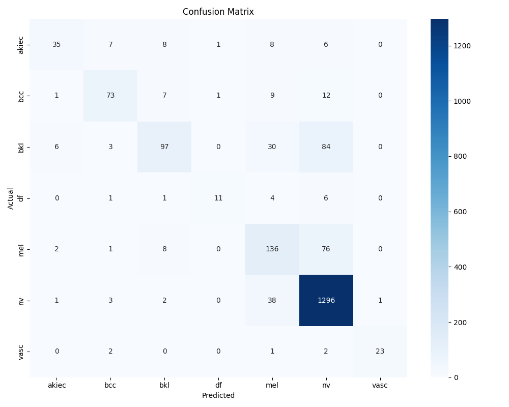
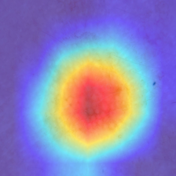
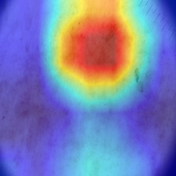
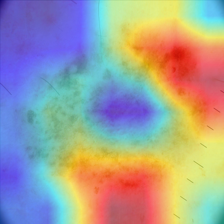
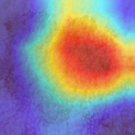

# AI-Powered Skin Lesion Classification with Grad-CAM

This project builds a deep learning-based system to classify skin lesion images into diagnostic categories and generate visual explanations for each prediction. Built using PyTorch and trained on the HAM10000 dataset, the model leverages transfer learning (ResNet50) and Grad-CAM heatmaps for explainability. The project aims to support early skin cancer diagnosis and transparent medical AI.

---

## 🤝 Project Overview

Skin cancer is one of the most common and potentially dangerous types of cancer worldwide. Dermatologists use dermatoscopic images to examine skin lesions and classify them as benign or malignant. However, diagnostic accuracy can vary based on experience.

This project aims to:
- Automatically classify dermatoscopic images into 7 lesion types
- Use Grad-CAM to visualize which parts of the image the model focused on
- Serve as a research prototype for AI in cancer prevention

---

## 📊 Dataset: HAM10000

**HAM10000** (Human Against Machine with 10,000 training images):
- ~10,000 high-resolution dermatoscopic images
- Collected from diverse populations and anatomical sites
- Includes 7 lesion categories:
  - `akiec`: Actinic Keratoses and Intraepithelial Carcinoma
  - `bcc`: Basal Cell Carcinoma
  - `bkl`: Benign Keratosis-like Lesions
  - `df`: Dermatofibroma
  - `mel`: Melanoma
  - `nv`: Melanocytic Nevi
  - `vasc`: Vascular Lesions
- Includes metadata: age, sex, anatomical location

---

## 🚀 Model Pipeline

### 1. **Preprocessing & EDA**
- Metadata exploration: diagnosis distribution, age groups, lesion locations
- Visualization of class imbalance and sex-based distribution
- Sample images per lesion class for sanity checks (via `visualize_images.py`)

### 2. **Training with ResNet50**
- **Backbone**: ResNet50 pretrained on ImageNet
- Replaced final layer with 7-class output
- Image resized to 224x224, normalized to [-1, 1]
- Optimizer: Adam | Loss: CrossEntropyLoss | Epochs: 3 | Batch size: 32
- Trained on 80% of the dataset, validated on 20%

### 3. **Evaluation**
- Classification report with precision, recall, F1-score
- Confusion matrix to analyze class-wise performance

### 4. **Explainability with Grad-CAM**
- Generates heatmaps showing model focus during prediction
- Useful for clinician trust and debugging AI behavior

---

## 📊 Results Summary

### ✅ Overall Performance
- **Accuracy**: 83%
- **Weighted F1-score**: 82%
- **Validation set size**: 2,003 images

### 📉 Classification Report (Sample)
```
akiec       precision=0.78  recall=0.54  f1=0.64
bcc         precision=0.81  recall=0.71  f1=0.76
bkl         precision=0.79  recall=0.44  f1=0.57
df          precision=0.85  recall=0.48  f1=0.61
mel         precision=0.60  recall=0.61  f1=0.61
nv          precision=0.87  recall=0.97  f1=0.92
vasc        precision=0.96  recall=0.82  f1=0.88
```

### ❄️ Confusion Matrix
- The model performs strongly on common classes like `nv`
- Some confusion exists between `mel` and `bkl`, which is expected due to visual similarity



---

## 🔍 Grad-CAM Visualizations

Grad-CAM overlays show which areas of the image were important for classification. These help understand **where the model is focusing**, and whether it aligns with clinical logic.

### AKIEC Example
Focuses strongly on the lesion center.



### BCC Example
Correct focus on lesion border and texture.



### MEL vs BKL Comparison
Both melanoma and benign keratosis-like lesions show **strong central focus** in Grad-CAM, which reflects how visually similar these lesions can appear.

**MEL Example:**


**BKL Example:**


> These Grad-CAM heatmaps suggest that while the model is focusing on relevant regions, visual overlap between melanoma and benign lesions contributes to confusion. This reinforces the importance of incorporating metadata (like age, lesion site) or histopathology for better accuracy.

---

## 🔢 Folder Structure
```
ai-skin-cancer-diagnosis/
├── data/                     # Metadata only (images excluded)
├── results/                  # Evaluation plots and Grad-CAM outputs
│   ├── confusion_matrix.png
│   └── gradcam/*.png
├── src/                     # Python scripts
│   ├── eda_metadata.py
│   ├── train_model.py
│   ├── evaluate_model.py
│   ├── gradcam_visualization.py
│   └── visualize_images.py
├── requirements.txt
├── README.md
```

---

## ▶️ How to Run This Project

```bash
# Step 1: Create and activate virtual environment
python -m venv venv
venv\Scripts\activate       # Windows

# Step 2: Install dependencies
pip install -r requirements.txt

# Step 3: Run scripts in order
python src/eda_metadata.py
python src/visualize_images.py
python src/train_model.py
python src/evaluate_model.py
python src/gradcam_visualization.py
```

---

## 💡 Future Extensions
- Add patient metadata as model input (multimodal learning)
- Fine-tune with class weighting or augmentation for imbalanced classes
- Build Streamlit UI for live demo or web-based clinical support

---

## 👨‍💻 Author
**Endri Gupta**  
MSc Life Science Informatics, University of Bonn 
Interested in AI for Cancer Research | Deep Learning in Healthcare | XAI

---

## 📄 License
CC BY-NC-SA 4.0 — open for academic, research, and non-commercial use.


